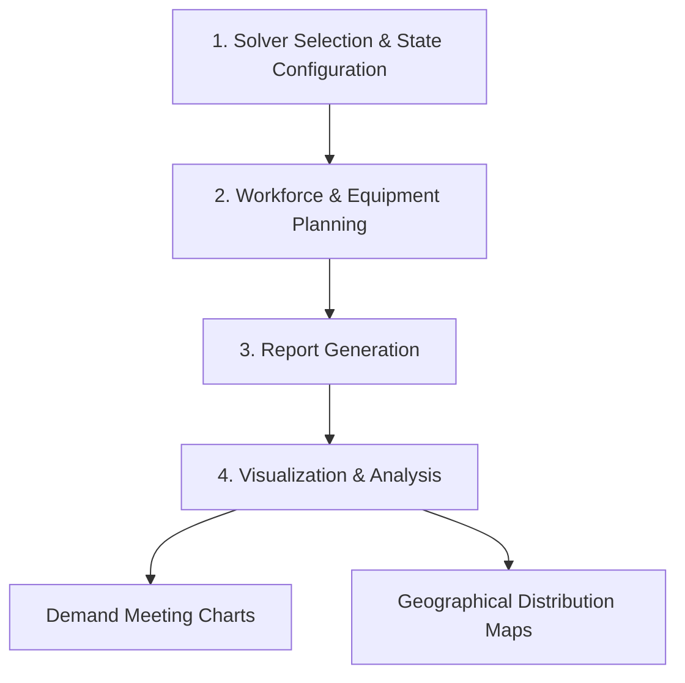

# Designing a Minimum-Cost Health System for Countrywide Universal Coverage

## Overview

This repository contains the implementation and supplementary materials for the research paper **"Designing a Minimum-Cost Health System for Countrywide Universal Coverage"**. The project presents a novel analysis framework for designing national health systems that optimize both effectiveness through universal coverage and efficiency through cost minimization.

### Research Context

Our study addresses the critical challenge of healthcare system design by considering multiple factors:
- **Workforce allocation** across different care levels
- **Equipment distribution** for optimal coverage
- **Global cost optimization** while maintaining accessibility
- **Geographical context** and population distribution patterns

The model serves as a medium- and long-term strategic planning tool, leveraging data from prestigious sources including the OECD, World Bank, OpenStreetMap, and national health statistics.

### Case Studies

The framework has been applied and validated across three diverse countries:
- **🇧🇷 Brazil**: Focus on dispersed populations in central-western regions
- **🇫🇷 France**: Exploring centralized healthcare model optimization
- **🇫🇮 Finland**: Addressing northern Finland's unique geographical challenges

## Research Alignment

This work directly supports:
- **UN Sustainable Development Goal 3.8**: Achieving universal health coverage
- **WHO's Human Resources for Health Strategy**: Optimizing healthcare workforce distribution

## Key Findings

### Brazil
- **Investment needed**: $7.95 billion in logistics infrastructure
- **Target**: 1,222 municipalities with low accessibility
- **Recommendations**: 
  - Increase health professional hiring
  - Expand radiotherapy equipment
  - Establish small hospitals and clinics in dispersed areas

### Finland
- **Infrastructure needs**: Additional hospital beds and CT scanners
- **Focus areas**: Northern regions with challenging geography

### France
- **Model recommendation**: More centralized healthcare delivery
- **Investment priorities**: Nursing staff and mammography equipment
- **Strategy**: Municipality-based comprehensive care provision

## System Architecture

### Optimization Workflow



### Healthcare Resources (9 Categories)

| ID | Resource Type | Description |
|----|---------------|-------------|
| 1 | Physicians | Medical doctors across all specialties |
| 2 | Nurses | Registered nursing staff |
| 3 | Other Cadres | Allied health professionals |
| 4 | Community-Based | Community health workers |
| 5 | Beds | Hospital bed capacity |
| 6 | CT Scanner | Computed tomography equipment |
| 7 | MRI Unit | Magnetic resonance imaging |
| 8 | Mammography | Breast cancer screening equipment |
| 9 | Radiotherapy | Cancer treatment equipment |

### Care Hierarchy Levels

1. **Primary Care**: First point of contact, preventive care, basic treatments
2. **Secondary Care**: Specialist consultations, routine procedures
3. **Tertiary Care**: Complex procedures, specialized treatments, research hospitals

## Project Structure

```
BR/
├── app/                        # Main application entry point
├── negocio/                    # Business logic and core algorithms
│   ├── config.py              # Optimization settings and state configurations
│   ├── orides.py              # Origin-destination assignment processing
│   ├── demand.py              # Demand analysis and workforce/equipment graphics
│   └── solvers.py             # Solver selection and configuration
├── resultado/                  # Generated results, reports, and visualizations
├── dados_recursos.csv          # Exported resource allocation data
├── *.txt                      # Distance and travel duration matrices
├── *.dat                      # Mathematical model parameters by state
├── *.mod                      # Mathematical programming model files
├── requirements.txt           # Python package dependencies
└── README.md                  # Project documentation (this file)
```

## Installation and Setup

### Prerequisites

⚠️ **Important Version Requirements**
- **Python 3.10** (required for geoplotlib compatibility)
- **Pip 21.2.3** (required for geoplotlib charts)

### Installation Steps

1. **Clone the repository**
   ```bash
   git clone <repository-url>
   cd BR
   ```

2. **Create virtual environment**
   ```bash
   python -m venv venv
   ```

3. **Activate virtual environment**
   
   **Windows:**
   ```bash
   venv\Scripts\activate
   ```
   
   **Linux/Mac:**
   ```bash
   source venv/bin/activate
   ```

4. **Install dependencies**
   ```bash
   pip install -r requirements.txt
   ```

## Usage

### Running the Complete Analysis

Execute the full simulation across all scenarios:

```bash
cd BR-FR-FI-3hc
./run.bat
```

This command will:
- Process all configured states/regions
- Generate optimization results
- Create visualizations and reports
- Export analysis data

## Output and Results

### Generated Files

| File Pattern | Description |
|--------------|-------------|
| `Notes.txt` | General system design overview and recommendations |
| `0X-Atribuicao-Nivel-Y.csv` | Resource assignment by care level (1,2,3) |
| `0X-Atend-Demanda-Nivel-Y.csv` | Demand fulfillment by care level (1,2,3) |
| `07-Atend-Demanda-Nivel-Especialidade.csv` | Specialty-level demand analysis |
| `Estatisticas_de_atendimento.txt` | Comprehensive care statistics |
| `logfile.log` | Execution logs and debugging information |

### Analysis Components

- **📊 Travel Time Statistics**: Patient accessibility metrics
- **👥 Workforce Analysis**: Professional distribution and requirements
- **🏥 Equipment Planning**: Medical equipment allocation optimization
- **📈 Interactive Charts**: Demand patterns and resource utilization
- **🗺️ Geographic Maps**: Spatial distribution of healthcare resources

## Technical Dependencies

### Core Libraries

| Package | Version | Purpose |
|---------|---------|---------|
| `bokeh` | 2.3.3 | Interactive visualization |
| `geoplotlib` | 0.3.2 | Geographic mapping |
| `matplotlib` | 3.5.3 | Statistical plotting |
| `numpy` | 1.23.2 | Numerical computing |
| `scipy` | 1.9.1 | Scientific computing |

### Complete Dependency List

```
pip==21.2.3
bokeh==2.3.3
cycler==0.10.0
fonttools==4.37.1
geoplotlib==0.3.2
Jinja2==2.11.2
kiwisolver==1.4.4
MarkupSafe==1.1.1
matplotlib==3.5.3
numpy==1.23.2
packaging==20.8
Pillow==9.2.0
pyglet==1.5.14
pyparsing==2.4.7
python-dateutil==2.8.1
PyYAML==5.3.1
scipy==1.9.1
six==1.15.0
tornado==6.1
typing-extensions==3.7.4.3
```

## Research Methodology

Our approach employs a **location-allocation optimization model** that uniquely integrates:

- **Demographic Data**: Population distribution and healthcare needs
- **Geographic Constraints**: Travel distances and accessibility barriers  
- **Resource Costs**: Workforce salaries, equipment procurement, maintenance
- **Quality Standards**: Meeting clinical guidelines and coverage requirements

The mathematical programming model optimizes the placement and sizing of healthcare facilities while minimizing total system cost subject to universal coverage constraints.

## Contributing

This research tool is designed for:
- **Healthcare policy researchers**
- **Government health ministry planners** 
- **International development organizations**
- **Academic institutions** studying health system optimization

## Authors

- **João Flávio de Freitas Almeida** (Corresponding Author) - [ORCID: 0000-0002-3884-217X](https://orcid.org/0000-0002-3884-217X)
- **Fabricio Oliveira** - [ORCID: 0000-0003-0300-9337](https://orcid.org/0000-0003-0300-9337)
- **Samuel Vieira Conceição** - [ORCID: 0000-0002-8090-264X](https://orcid.org/0000-0002-8090-264X)
- **Virginie Goepp** - [ORCID: 0000-0003-2294-7919](https://orcid.org/0000-0003-2294-7919)
- **Francisco Carlos Cardoso de Campos** - [ORCID: 0000-0003-2172-0181](https://orcid.org/0000-0003-2172-0181)

## Publication Information

- **Journal**: Health Systems
- **Year**: 2025
- **DOI**: (to be completed upon publication)

## Citation

If you use this work in your research, please cite our paper:

```bibtex
@article{almeida2025designing,
  title={Designing a Minimum-Cost Health System for Countrywide Universal Coverage},
  author={Almeida, Jo{\~a}o Fl{\'a}vio de Freitas and Oliveira, Fabricio and Concei{\c{c}}{\~a}o, Samuel Vieira and Goepp, Virginie and de Campos, Francisco Carlos Cardoso},
  journal={Health Systems},
  year={2025},
  doi={[to be completed]}
}
```

**APA Format:**
```
Almeida, J. F. F., Oliveira, F., Conceição, S. V., Goepp, V., & de Campos, F. C. C. (2025). 
Designing a minimum-cost health system for countrywide universal coverage. 
Health Systems. doi:[to be completed]
```

## License

[Specify license information]

## Contact

For questions about the methodology, implementation, or applications to other countries, please contact [research team contact information].

---

*This project contributes to global efforts in achieving universal health coverage through evidence-based health system design and optimization.*